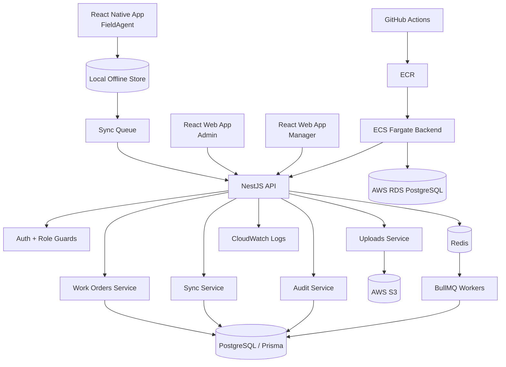
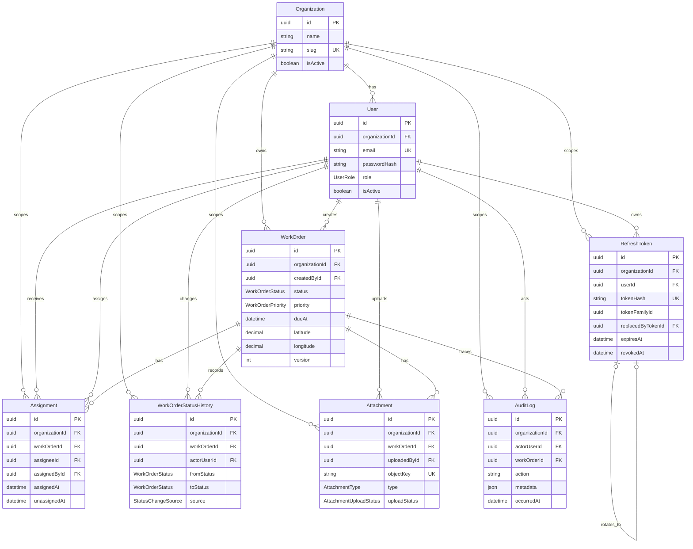

# OpsPulse: Offline-first Field Operations Platform

OpsPulse is a production-flavoured portfolio project for managing field work. It is designed to show full-stack and mobile engineering skills across product design, role-based access, offline-first workflows, backend architecture, background jobs, auditability, and cloud deployment readiness.

The project is intentionally not a random CRUD app. It models a real field operations workflow where office teams create and assign work, and field agents complete jobs from a mobile app even when the network is unreliable.

## Target Users


| Role       | Primary responsibility                                                                                                           |
| ---------- | -------------------------------------------------------------------------------------------------------------------------------- |
| Admin      | Creates work orders, manages users, reviews audit logs, monitors failed syncs and SLA breaches.                                  |
| Manager    | Assigns work orders to field agents and tracks job progress.                                                                     |
| FieldAgent | Completes assigned work orders from the React Native app, including offline updates, photo proof, QR scan, and location capture. |


## MVP Scope

### In Scope

- Login/logout with JWT-based sessions.
- Role-based access for Admin, Manager, and FieldAgent.
- Admin creates work orders.
- Manager assigns work orders to FieldAgents.
- FieldAgent views assigned jobs in React Native.
- FieldAgent can queue job actions while offline and sync later.
- FieldAgent can upload proof photo.
- FieldAgent can capture location.
- FieldAgent can scan QR code.
- Admin dashboard shows job status, audit logs, failed syncs, and SLA breaches.
- Backend supports retries, audit logs, caching, background jobs, and structured production logs.
- Local development uses Docker Compose.
- Production deployment target uses S3, RDS PostgreSQL, ECR, ECS Fargate, CloudWatch, and GitHub Actions.

### Out Of Scope For v1

- Real-time maps.
- Route optimization.
- Payments.
- Multi-tenant billing.
- Advanced analytics.
- Native push notifications unless added later.

## Tech Stack


| Area                 | Technology                |
| -------------------- | ------------------------- |
| Mobile app           | React Native              |
| Admin web app        | React                     |
| Backend API          | NestJS                    |
| Database             | PostgreSQL with Prisma    |
| Queue and cache      | Redis with BullMQ         |
| Local infrastructure | Docker and Docker Compose |
| File uploads         | AWS S3                    |
| Production database  | AWS RDS PostgreSQL        |
| Backend deployment   | AWS ECR and ECS Fargate   |
| Logs                 | AWS CloudWatch            |
| CI/CD                | GitHub Actions            |


## Main User Flows

1. Admin logs in, creates a work order, and later reviews status history and audit logs.
2. Manager logs in, assigns the work order to a FieldAgent, and monitors SLA risk.
3. FieldAgent logs into the mobile app, downloads assigned jobs, works offline if needed, captures proof photo, location, and QR scan, then syncs queued actions when online.
4. Backend validates each sync action, applies allowed state transitions, writes audit logs, retries background jobs, and exposes failed syncs to admins.

## Core Backend Modules


| Module            | Responsibility                                                                   |
| ----------------- | -------------------------------------------------------------------------------- |
| AuthModule        | Login, JWT issuing, authentication guards, role guards.                          |
| UsersModule       | User profile, role data, active/inactive users.                                  |
| WorkOrdersModule  | Create work orders, update status, read job details and history.                 |
| AssignmentsModule | Assign work orders to FieldAgents and track ownership.                           |
| SyncModule        | Accept offline actions, validate order, resolve simple conflicts, mark failures. |
| UploadsModule     | Generate S3 presigned upload URLs and attach uploaded proof files.               |
| AuditLogsModule   | Store immutable business events for traceability.                                |
| SlaModule         | Detect work orders at risk or already breached.                                  |
| QueueModule       | BullMQ queues, retries, delayed jobs, and worker registration.                   |
| HealthModule      | API, database, Redis, and worker readiness checks.                               |


## High-level Architecture



## Core Database Model

The core schema is tenant-scoped through `organizationId`. Assignments and
status changes are stored as history instead of overwriting important business
facts. Files remain in object storage; PostgreSQL stores attachment metadata
only.



Important database invariants:

- Email and organization slug must already be trimmed lowercase values.
- A WorkOrder can have only one current Assignment (`unassignedAt IS NULL`).
- Optional coordinates are accepted, but supplied latitude and longitude must
  be within valid geographic ranges.
- `organizationId` must scope every future repository query.
- `OfflineSyncAction` is intentionally deferred to the sync-focused migration;
  `WorkOrder.version`, history, attachments, and audit logs prepare for it.

## Local Development Roadmap

1. Create the NestJS backend with health check, config validation, and Prisma setup.
2. Add PostgreSQL and Redis through Docker Compose.
3. Implement authentication and role guards.
4. Build work order creation, assignment, and status updates.
5. Add audit logging for important business actions.
6. Build React web admin screens for dashboard and work order management.
7. Build React Native FieldAgent screens with a local offline queue.
8. Add sync API, retry handling, and failed sync visibility.
9. Add S3 presigned upload flow for proof photos.
10. Add background jobs for SLA checks and retry workflows.

## Production Deployment Roadmap

1. Containerize the backend API.
2. Push backend image to AWS ECR using GitHub Actions.
3. Run backend on ECS Fargate.
4. Use RDS PostgreSQL for production data.
5. Use S3 for proof photo storage.
6. Send backend logs to CloudWatch.
7. Keep secrets in environment variables or AWS-managed secret storage.
8. Start with the smallest practical AWS resources to reduce cost.

No AWS resources are created in this repository yet.

## Current Project Status


| Area                   | Status      |
| ---------------------- | ----------- |
| Product scope          | Defined     |
| Architecture           | Defined     |
| Domain model           | Implemented |
| Backend foundation     | Implemented |
| Core database model    | Implemented |
| Web implementation     | Shell implemented |
| Mobile implementation  | Shell implemented |
| Docker PostgreSQL      | Implemented |
| AWS deployment         | Not started |


## Interview Pitch

OpsPulse is an offline-first field operations platform. Admins create work orders, managers assign them, and field agents complete jobs from a mobile app even without internet. The mobile app stores actions locally and syncs them later. The backend validates those actions, stores audit logs, runs background jobs with Redis and BullMQ, and exposes dashboards for failed syncs and SLA breaches. The system is designed like a real production project with role-based access, PostgreSQL persistence, file uploads to S3, containerized services, and a path to ECS deployment.

## Documentation

- [Product scope](docs/product-scope.md)
- [Architecture](docs/architecture.md)
- [Domain model](docs/domain-model.md)
- [Interview guide](docs/interview-guide.md)

## Monorepo Foundation

OpsPulse uses a pnpm workspace so the backend, admin web app, mobile app,
and shared TypeScript contracts can live in one product repository.

```text
apps/
  api/       NestJS backend API
  web/       React admin/control tower
  mobile/    Bare React Native FieldAgent app
packages/
  shared/    Shared TypeScript contracts and constants
```

### Setup

```bash
corepack enable
corepack prepare pnpm@10.34.3 --activate
pnpm install

pnpm --filter @opspulse/shared build
pnpm typecheck
pnpm --filter @opspulse/web build
pnpm --filter @opspulse/api build
```

Create local frontend configuration files:

```bash
cp apps/web/.env.example apps/web/.env
cp apps/mobile/.env.example apps/mobile/.env
```

Install iOS dependencies once after `pnpm install`:

```bash
cd apps/mobile
bundle install
bundle exec pod install --project-directory=ios
cd ../..
```

Because `@opspulse/shared` exports from `dist`, build it before starting an app
that imports it:

```bash
pnpm --filter @opspulse/shared build
pnpm --filter @opspulse/api dev
pnpm --filter @opspulse/web dev
pnpm --filter @opspulse/mobile ios
```

Expected local URLs:

- API health: `http://localhost:3000/health`
- Web app: Vite prints the local URL, usually `http://localhost:5173`
- Mobile API URL for the iOS simulator: `http://127.0.0.1:3000`

The Android emulator reaches the host machine at `http://10.0.2.2:3000`. A
physical device must use the development machine's reachable LAN address.

### Frontend Shells

The web app uses feature-oriented folders for authentication, dashboard, and
work orders. React Router owns URL navigation, while an in-memory demo session
only demonstrates protected navigation. It is not real authentication.

The mobile app uses a root native stack for login, the authenticated app, and
job detail. Bottom tabs own Jobs, Offline Queue, and Profile. Real token
storage, assigned-job loading, offline persistence, camera, location, QR, and
sync remain deferred.

Both clients use small platform-specific `fetch` wrappers and shared health and
error response types. Requests time out and expose errors, but they do not retry
automatically. Users retry explicitly so development failures stay visible.

Browser requests require the API to allow the web origin through CORS. React
Native uses native networking rather than browser CORS, but it still needs an
API URL reachable from the simulator or device.

Interview explanation:

> I separated navigation, feature screens, environment configuration, and API
> access so the shells can grow without turning the root component into a large
> dependency hub. Frontend route protection improves navigation UX, but the
> backend remains responsible for authentication, roles, and ownership checks.

### Why Monorepos Matter

Real full-stack product teams often need to change backend contracts, web UI,
mobile flows, and shared types together. A monorepo makes those changes easier to
review and test in one place.

For OpsPulse, shared role names and work order statuses live in
`@opspulse/shared` instead of being duplicated across the API and UI. The
important trade-off is discipline: apps should not import each other, and shared
packages should stay focused on stable contracts rather than becoming a dumping
ground for unrelated business logic.

Interview explanation:

> I used a pnpm monorepo so the API, web app, mobile app, and shared TypeScript
> contracts can evolve together. It reduces duplicated constants and makes
> cross-app changes reviewable in one commit, while still keeping clear
> boundaries between product surfaces.
