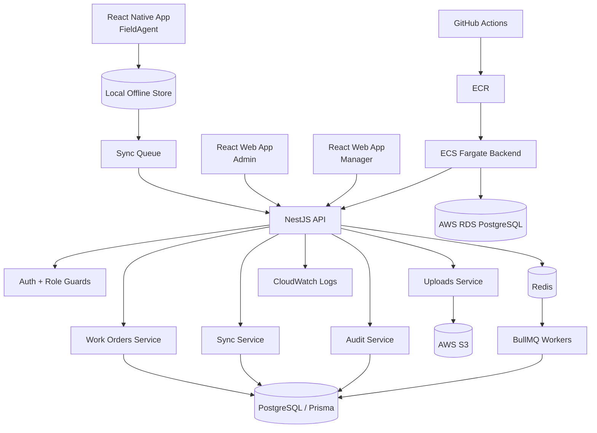

# OpsPulse: Offline-first Field Operations Platform

OpsPulse is a production-flavoured portfolio project for managing field work. It is designed to show full-stack and mobile engineering skills across product design, role-based access, offline-first workflows, backend architecture, background jobs, auditability, and cloud deployment readiness.

The project is intentionally not a random CRUD app. It models a real field operations workflow where office teams create and assign work, and field agents complete jobs from a mobile app even when the network is unreliable.

## Target Users

| Role       | Primary responsibility                                                                                                           |
| ---------- | -------------------------------------------------------------------------------------------------------------------------------- |
| Admin      | Creates work orders, manages users, reviews audit logs, monitors failed syncs and SLA breaches.                                  |
| Manager    | Assigns work orders to field agents and tracks job progress.                                                                     |
| FieldAgent | Completes assigned work orders from the React Native app, including offline updates, photo proof, QR scan, and location capture. |

## MVP Scope

### In Scope

- Login/logout with JWT-based sessions.
- Role-based access for Admin, Manager, and FieldAgent.
- Admin creates work orders.
- Manager assigns work orders to FieldAgents.
- FieldAgent views assigned jobs in React Native.
- FieldAgent can queue job actions while offline and sync later.
- FieldAgent can upload proof photo.
- FieldAgent can capture location.
- FieldAgent can scan QR code.
- Admin dashboard shows job status, audit logs, failed syncs, and SLA breaches.
- Backend supports retries, audit logs, caching, background jobs, and structured production logs.
- Local development uses Docker Compose.
- Production deployment target uses S3, RDS PostgreSQL, ECR, ECS Fargate, CloudWatch, and GitHub Actions.

### Out Of Scope For v1

- Real-time maps.
- Route optimization.
- Payments.
- Multi-tenant billing.
- Advanced analytics.
- Native push notifications unless added later.

## Tech Stack

| Area                 | Technology                |
| -------------------- | ------------------------- |
| Mobile app           | React Native              |
| Admin web app        | React                     |
| Backend API          | NestJS                    |
| Database             | PostgreSQL with Prisma    |
| Queue and cache      | Redis with BullMQ         |
| Local infrastructure | Docker and Docker Compose |
| File uploads         | AWS S3                    |
| Production database  | AWS RDS PostgreSQL        |
| Backend deployment   | AWS ECR and ECS Fargate   |
| Logs                 | AWS CloudWatch            |
| CI/CD                | GitHub Actions            |

## Main User Flows

1. Admin logs in, creates a work order, and later reviews status history and audit logs.
2. Manager logs in, assigns the work order to a FieldAgent, and monitors SLA risk.
3. FieldAgent logs into the mobile app, downloads assigned jobs, works offline if needed, captures proof photo, location, and QR scan, then syncs queued actions when online.
4. Backend validates each sync action, applies allowed state transitions, writes audit logs, retries background jobs, and exposes failed syncs to admins.

## Core Backend Modules

| Module            | Responsibility                                                                   |
| ----------------- | -------------------------------------------------------------------------------- |
| AuthModule        | Login, JWT issuing, authentication guards, role guards.                          |
| UsersModule       | User profile, role data, active/inactive users.                                  |
| WorkOrdersModule  | Create work orders, update status, read job details and history.                 |
| AssignmentsModule | Assign work orders to FieldAgents and track ownership.                           |
| SyncModule        | Accept offline actions, validate order, resolve simple conflicts, mark failures. |
| UploadsModule     | Generate S3 presigned upload URLs and attach uploaded proof files.               |
| AuditLogsModule   | Store immutable business events for traceability.                                |
| SlaModule         | Detect work orders at risk or already breached.                                  |
| QueueModule       | BullMQ queues, retries, delayed jobs, and worker registration.                   |
| HealthModule      | API, database, Redis, and worker readiness checks.                               |

## High-level Architecture

## Local Development Roadmap

1. Create the NestJS backend with health check, config validation, and Prisma setup.
2. Add PostgreSQL and Redis through Docker Compose.
3. Implement authentication and role guards.
4. Build work order creation, assignment, and status updates.
5. Add audit logging for important business actions.
6. Build React web admin screens for dashboard and work order management.
7. Build React Native FieldAgent screens with a local offline queue.
8. Add sync API, retry handling, and failed sync visibility.
9. Add S3 presigned upload flow for proof photos.
10. Add background jobs for SLA checks and retry workflows.

## Production Deployment Roadmap

1. Containerize the backend API.
2. Push backend image to AWS ECR using GitHub Actions.
3. Run backend on ECS Fargate.
4. Use RDS PostgreSQL for production data.
5. Use S3 for proof photo storage.
6. Send backend logs to CloudWatch.
7. Keep secrets in environment variables or AWS-managed secret storage.
8. Start with the smallest practical AWS resources to reduce cost.

No AWS resources are created in this repository yet.

## Current Project Status

| Area                   | Status      |
| ---------------------- | ----------- |
| Product scope          | Defined     |
| Architecture           | Defined     |
| Domain model           | Defined     |
| Backend implementation | Not started |
| Web implementation     | Not started |
| Mobile implementation  | Not started |
| Docker setup           | Not started |
| AWS deployment         | Not started |

## Interview Pitch

OpsPulse is an offline-first field operations platform. Admins create work orders, managers assign them, and field agents complete jobs from a mobile app even without internet. The mobile app stores actions locally and syncs them later. The backend validates those actions, stores audit logs, runs background jobs with Redis and BullMQ, and exposes dashboards for failed syncs and SLA breaches. The system is designed like a real production project with role-based access, PostgreSQL persistence, file uploads to S3, containerized services, and a path to ECS deployment.

## Documentation

- [Product scope](docs/product-scope.md)
- [Architecture](docs/architecture.md)
- [Domain model](docs/domain-model.md)
- [Interview guide](docs/interview-guide.md)

