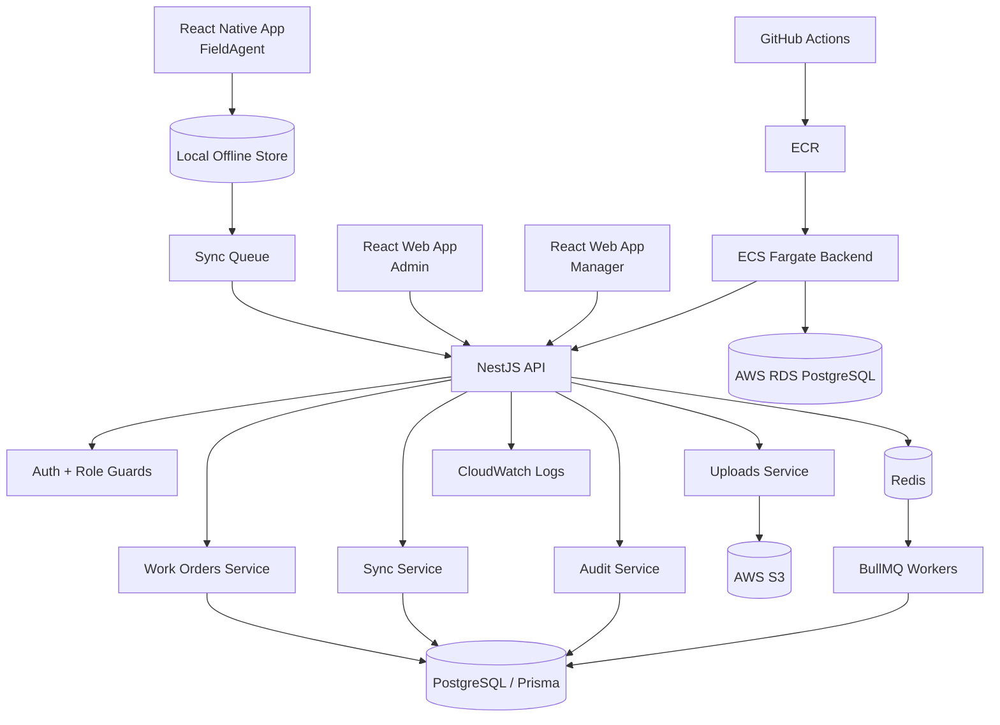

# Architecture

OpsPulse FieldOps uses a simple production-style architecture: React Native for field agents, React for office users, NestJS for the backend API, PostgreSQL for durable data, Redis and BullMQ for queues, and AWS services for the future production deployment.

## High-level Diagram



## Backend Architecture

The backend follows a clean NestJS structure:

```text
controller -> service -> repository/Prisma
```

- Controllers handle HTTP requests, DTO validation, and response shape.
- Services hold business rules such as allowed status transitions and assignment checks.
- Prisma handles database access.
- Guards enforce authentication and role-based access.
- Background workers handle retryable or scheduled work.

## Backend Modules

| Module | Purpose |
| --- | --- |
| AuthModule | Handles login, JWT issuing, authentication guard, and role guard. |
| UsersModule | Stores users, roles, profile data, and active/inactive state. |
| WorkOrdersModule | Owns work order creation, status updates, detail view, and history. |
| AssignmentsModule | Connects work orders to FieldAgents and records manager assignment decisions. |
| SyncModule | Accepts offline actions from mobile clients and records per-action success or failure. |
| UploadsModule | Creates S3 presigned URLs and links proof photos after upload. |
| AuditLogsModule | Stores immutable business events for traceability and debugging. |
| SlaModule | Detects breached or at-risk work orders using due dates and background jobs. |
| QueueModule | Configures BullMQ queues and workers. |
| HealthModule | Exposes readiness checks for API, database, Redis, and workers. |

## Database Entities

| Entity | Purpose |
| --- | --- |
| User | Stores login identity, role, name, email, and active status. |
| WorkOrder | Main job record with title, description, priority, status, due date, and location. |
| WorkOrderAssignment | Tracks which FieldAgent owns a work order and who assigned it. |
| WorkOrderStatusHistory | Stores status changes over time. |
| OfflineSyncAction | Stores mobile sync actions, processing status, and failure reason. |
| ProofPhoto | Stores metadata for proof photo uploads linked to work orders. |
| LocationPing | Stores captured latitude/longitude at meaningful job events. |
| QrScan | Stores scanned QR value and the related work order. |
| AuditLog | Stores immutable events like created, assigned, synced, completed, and failed. |
| SlaPolicy | Stores SLA rules or due-date thresholds. |
| JobRun | Stores background job execution metadata and failures. |

## React Native Screens

| Screen | Purpose |
| --- | --- |
| Login | FieldAgent authentication. |
| Job List | Shows assigned jobs and local sync indicators. |
| Job Detail | Shows job info, status actions, proof requirements, and location data. |
| Offline Queue | Shows pending, synced, and failed local actions. |
| Capture Proof Photo | Captures or selects a proof image for upload. |
| Capture Location | Captures current GPS coordinates. |
| Scan QR | Scans a job-site or asset QR code. |
| Sync Status/Profile | Shows account info, last sync time, and manual sync action. |

## React Web Screens

| Screen | Purpose |
| --- | --- |
| Login | Admin and Manager authentication. |
| Dashboard | Shows job status counts, failed syncs, SLA breaches, and operational summary. |
| Work Orders List | Search, filter, and inspect work orders. |
| Create Work Order | Admin creates new work orders. |
| Assignment View | Manager assigns or reassigns FieldAgents. |
| Work Order Detail | Full job details, status history, proof photos, location, QR scans, and audit trail. |
| Audit Logs | Searchable business event history. |
| Failed Syncs | Admin view for mobile actions that failed backend validation or processing. |
| SLA Breaches | Shows breached and at-risk work orders. |
| Users/Roles | Admin view for users and role assignment. |

## Offline-first Sync Strategy

The React Native app should treat the local store as the source of immediate user experience. When offline, actions are saved locally with enough metadata to replay them later.

Each queued action should include:

- A local action id.
- Work order id.
- Action type.
- Payload.
- Created timestamp.
- Retry count.
- Sync status.

The backend should process sync actions one by one and return a result per action. This keeps failures debuggable and prevents one bad action from hiding all other successful actions.

## Environment And Secrets

Secrets must never be hardcoded.

Expected configuration categories:

- Database URL.
- Redis URL.
- JWT secret and expiration.
- S3 bucket name and region.
- AWS credentials for local development only when needed.
- Log level.
- API port.

## AWS Deployment Shape

AWS is planned but not provisioned yet.

Least-cost production-style path:

1. Build backend Docker image.
2. Push image to ECR from GitHub Actions.
3. Run backend on ECS Fargate with a small task size.
4. Use RDS PostgreSQL for durable production data.
5. Use S3 for proof photos.
6. Send ECS logs to CloudWatch.

Billing warning: ECS, RDS, NAT gateways, load balancers, and CloudWatch logs can create AWS costs. Do not create AWS resources until the local MVP is working and the deployment plan is reviewed.

## Trade-offs

### Why NestJS

NestJS gives the backend a structured module system, dependency injection, DTO validation, guards, and testable services. This fits a portfolio project where architecture quality matters.

### Why PostgreSQL With Prisma

PostgreSQL is reliable for relational business data like users, work orders, assignments, histories, and audit logs. Prisma gives type-safe access and clear migrations.

### Why Redis And BullMQ

Redis and BullMQ are useful for background jobs, retries, delayed SLA checks, and sync-related processing. Companies use queues to keep API requests fast and move retryable work out of the request path.

### Why Offline-first

Field workers cannot depend on perfect network access. Offline-first improves user trust, but it adds complexity around local queues, retries, conflict handling, and auditability.
