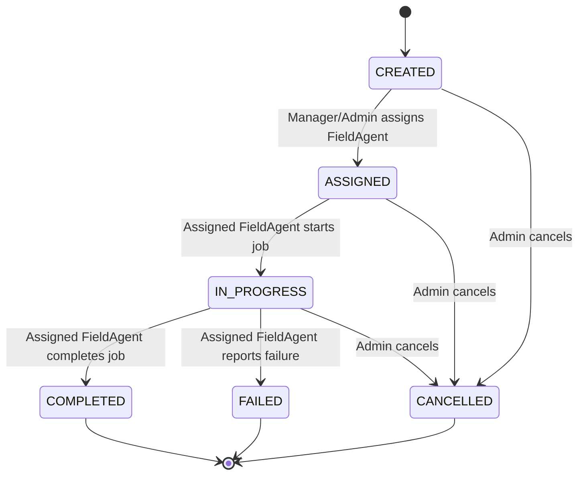
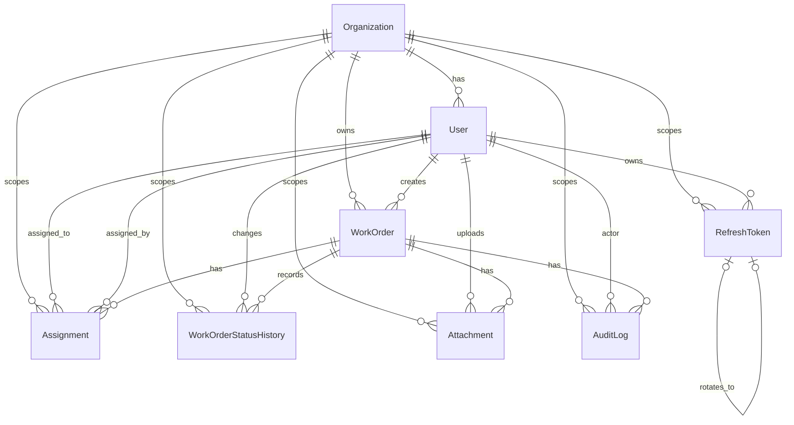

# Domain Model

This document defines how OpsPulse FieldOps behaves in real production cases: work order state changes, role permissions, offline sync idempotency, database relationships, and the first API surface.

The goal is to make the project explainable as a business system, not only a list of technologies.

## Work Order Lifecycle

OpsPulse FieldOps treats work order status as a controlled state machine. Users cannot move a work order to any random status just because the API exists.



## Status Rules

| Transition | Allowed actor | Rule |
| --- | --- | --- |
| `CREATED -> ASSIGNED` | Admin, Manager | Work order must not already be terminal. Assignee must be an active FieldAgent. |
| `CREATED -> CANCELLED` | Admin | Admin can cancel unassigned work. |
| `ASSIGNED -> IN_PROGRESS` | Assigned FieldAgent | Only the assigned FieldAgent can start the job. |
| `ASSIGNED -> CANCELLED` | Admin | Admin can cancel assigned work. |
| `IN_PROGRESS -> COMPLETED` | Assigned FieldAgent | Completion may require proof photo, QR scan, or location depending on work order rules. |
| `IN_PROGRESS -> FAILED` | Assigned FieldAgent | Failure reason is required. |
| `IN_PROGRESS -> CANCELLED` | Admin | Admin can cancel when business requires it. |
| Terminal status edit | Admin only | `COMPLETED`, `FAILED`, and `CANCELLED` are terminal. Normal users cannot edit them. |

Terminal statuses:

- `COMPLETED`
- `FAILED`
- `CANCELLED`

Important behavior:

- Every valid status transition creates a `WorkOrderStatusHistory` row.
- Every important transition creates an `AuditLog` row.
- Offline status updates are still validated during sync against the latest server state.
- Invalid offline actions are stored as failed sync actions instead of being silently ignored.

## Role Permission Matrix

| Feature | Admin | Manager | FieldAgent |
| --- | --- | --- | --- |
| Login/logout | Yes | Yes | Yes |
| Create work order | Yes | No for v1 | No |
| View all work orders | Yes | No | No |
| View team work orders | Yes | Yes | No |
| View assigned jobs | Yes | Yes for team | Own only |
| Assign work order | Yes | Yes for team | No |
| Reassign work order | Yes | Yes for team | No |
| Start job | No | No | Own only |
| Complete job | No | No | Own only |
| Mark job failed | No | No | Own only |
| Upload proof photo | No | No | Own only |
| Capture location | No | No | Own only |
| Submit QR scan | No | No | Own only |
| View audit logs | Yes | Limited to team | No |
| View failed syncs | Yes | Limited to team | Own only in mobile app |
| View SLA breaches | Yes | Limited to team | No |
| Manage users and roles | Yes | No | No |

Implementation note:

- Route guards should enforce broad role access.
- Services should enforce ownership and team-level business rules.
- Never rely only on frontend hiding buttons for authorization.

## Offline Sync Action Contract

Offline sync is the heart of OpsPulse FieldOps. Each mobile action must be replayable, traceable, and safe to retry.

### Client Action Shape

```json
{
  "clientActionId": "01JZ8S6RXK7MZC7JH9F2A6CN3Q",
  "actionType": "WORK_ORDER_STATUS_CHANGED",
  "entityType": "WORK_ORDER",
  "entityId": "work_order_123",
  "payload": {
    "nextStatus": "IN_PROGRESS"
  },
  "createdAtOnDevice": "2026-06-15T09:30:00.000Z",
  "deviceId": "field-agent-phone-01",
  "appVersion": "1.0.0"
}
```

### Required Fields

| Field | Purpose |
| --- | --- |
| `clientActionId` | Idempotency key generated by the mobile app. |
| `actionType` | Tells backend which business operation to apply. |
| `entityType` | Identifies the target domain type, such as `WORK_ORDER`. |
| `entityId` | Server id of the entity being changed. |
| `payload` | Action-specific data. |
| `createdAtOnDevice` | Time the action happened on the device. |
| `deviceId` | Helps debug device-specific sync issues. |
| `appVersion` | Helps debug version-specific sync issues. |

### Server Stored Fields

| Field | Purpose |
| --- | --- |
| `id` | Server primary key. |
| `clientActionId` | Unique per user/device action for idempotency. |
| `userId` | FieldAgent who submitted the action. |
| `status` | `PENDING`, `PROCESSED`, `FAILED`, or `DUPLICATE`. |
| `failureReason` | Human-readable reason when action fails. |
| `retryCount` | Number of processing attempts. |
| `createdAtOnDevice` | Original device timestamp. |
| `receivedAt` | Server receive timestamp. |
| `processedAt` | Server processing timestamp. |

### Supported v1 Action Types

| Action type | Payload |
| --- | --- |
| `WORK_ORDER_STATUS_CHANGED` | `nextStatus`, optional `failureReason` |
| `PROOF_PHOTO_ATTACHED` | `proofPhotoId` or uploaded file key |
| `LOCATION_CAPTURED` | `latitude`, `longitude`, `accuracy`, `capturedAt` |
| `QR_SCANNED` | `qrValue`, `scannedAt` |

## Sync API Response Shape

`POST /sync/actions` returns a batch response. Each action gets its own result so the mobile app can mark successful actions as synced and show clear reasons for failed actions.

### Batch Response Shape

```json
{
  "results": [
    {
      "clientActionId": "01JZ8S6RXK7MZC7JH9F2A6CN3Q",
      "status": "PROCESSED",
      "reason": null,
      "message": "Action synced successfully.",
      "serverEntityVersion": 12
    }
  ]
}
```

### Per-action Result Fields

| Field | Purpose |
| --- | --- |
| `clientActionId` | Lets the mobile app match the response to the local queued action. |
| `status` | `PROCESSED`, `FAILED`, or `DUPLICATE`. |
| `reason` | Stable machine-readable reason code when status is `FAILED` or `DUPLICATE`. |
| `message` | Human-readable explanation safe to show in the mobile app. |
| `serverEntityVersion` | Optional latest server version for the affected entity. |

### Example Results

Processed:

```json
{
  "clientActionId": "status-start-001",
  "status": "PROCESSED",
  "reason": null,
  "message": "Work order status updated to IN_PROGRESS.",
  "serverEntityVersion": 8
}
```

Failed:

```json
{
  "clientActionId": "complete-offline-001",
  "status": "FAILED",
  "reason": "WORK_ORDER_ALREADY_CANCELLED",
  "message": "This work order was cancelled before your offline completion was synced.",
  "serverEntityVersion": 9
}
```

Duplicate:

```json
{
  "clientActionId": "status-start-001",
  "status": "DUPLICATE",
  "reason": "CLIENT_ACTION_ALREADY_PROCESSED",
  "message": "This action was already synced earlier.",
  "serverEntityVersion": 8
}
```

## Idempotency And Duplicate Syncs

Problem:

The mobile app may send the same offline action more than once because of retries, flaky networks, or app restarts.

Decision:

Use `clientActionId` as an idempotency key. For v1, it should be unique per user.

Backend behavior:

1. Receive sync action.
2. Check whether `clientActionId` already exists for the authenticated user.
3. If it was already processed, return the previous result instead of applying it again.
4. If it previously failed, return the failure unless the user submits a new action with a new `clientActionId`.
5. If it is new, validate and process it.

Interview explanation:

> I use a client-generated action id as an idempotency key. If the mobile app retries the same sync request, the backend recognizes it and avoids creating duplicate status updates, audit logs, or proof records.

## Conflict Handling Strategy

OpsPulse FieldOps v1 uses simple server-authoritative conflict handling.

Rules:

- The server is the source of truth for final work order state.
- Offline actions are accepted only if they are still valid against current server state.
- Actions are processed in `createdAtOnDevice` order for each user when possible.
- Invalid actions are marked `FAILED` with a reason visible in failed sync views.
- Duplicate actions are marked or returned as `DUPLICATE` without reapplying side effects.

Examples:

| Scenario | Backend result |
| --- | --- |
| FieldAgent sends `ASSIGNED -> IN_PROGRESS` twice | First succeeds, second returns duplicate or previous result. |
| FieldAgent completes a work order already cancelled by Admin | Sync action fails with `WORK_ORDER_ALREADY_CANCELLED`. |
| FieldAgent uploads proof for another agent's work order | Sync action fails with `NOT_ASSIGNED_TO_WORK_ORDER`. |
| FieldAgent completes without required proof photo | Sync action fails with `PROOF_PHOTO_REQUIRED`. |

This is intentionally conservative. It is easier to explain, safer for v1, and close to how many business systems behave.

## Entity Relationships



Relationship notes:

- Every tenant-owned record has an `organizationId`.
- `User` has many `Assignment` records as both assignee and assigner.
- `Assignment.unassignedAt = null` means the current assignment; it does not
  mean the WorkOrder is incomplete.
- `WorkOrder` has many `WorkOrderStatusHistory` rows.
- `WorkOrder` has many `Attachment` and `AuditLog` rows.
- `Attachment` belongs to a `WorkOrder` and its uploading `User`.
- `AuditLog` belongs to a `WorkOrder` when the event is work-order related.
- `RefreshToken` stores only a token hash and can point to its replacement
  during token rotation.
- `OfflineSyncAction`, `LocationPing`, `QrScan`, `SlaPolicy`, and `JobRun` are
  intentionally deferred to focused later migrations.

## Database Constraints

These constraints are implemented by the core Prisma schema and migration.

| Entity | Constraint |
| --- | --- |
| `Organization` | `slug` is globally unique and must be stored as trimmed lowercase text. |
| `User` | `email` is globally unique, must be stored as trimmed lowercase text, and the user belongs to one Organization. |
| `WorkOrder` | `status` should be an enum, not free-form text. |
| `WorkOrder` | Optional latitude and longitude are nullable-safe but range checked when supplied. |
| `AuditLog` | Append-only from application behavior; reference an actor `User` when user-triggered and optionally reference a `WorkOrder`. |
| `Attachment` | Must belong to one `WorkOrder` and one uploading `User`; only object metadata is stored in PostgreSQL. |
| `Assignment` | Must reference one `WorkOrder`, one assignee, and one assigner; a partial unique index permits only one current assignment. |
| `WorkOrderStatusHistory` | Must reference one `WorkOrder` and the actor `User` when user-triggered. |
| `RefreshToken` | Raw tokens are never stored; token hashes and replacement links are unique. |

Implementation notes:

- Use database foreign keys for ownership relationships where practical.
- Prefer enum columns for stable domain states such as role, work order status, sync status, and action type.
- Store failure reason codes as stable strings or enums so frontend behavior does not depend on changing message text.
- Do not hard-delete audit logs during normal application flows.
- Prisma cannot represent the partial unique assignment index or these CHECK
  constraints directly. Their migration SQL is commented and must be preserved
  if the migration is regenerated.
- Services must normalize email and slug before persistence, scope every query
  by `organizationId`, and validate cross-organization and role rules.

Safe audit metadata contains a small allow-listed business summary:

```json
{
  "fromStatus": "ASSIGNED",
  "toStatus": "IN_PROGRESS",
  "source": "API"
}
```

Never store passwords, tokens, authorization headers, complete request bodies,
uncontrolled client payloads, or raw GPS histories in audit metadata.

`OfflineSyncAction` remains planned for the sync-focused migration. It will own
client-action idempotency, processing status, retry state, duplicate detection,
and failure details. The current `WorkOrder.version`, status history,
attachments, and audit logs provide the supporting foundation.

## API Endpoint Draft

This is not final code. It is the first backend contract so implementation has direction.

### Auth

| Method | Path | Purpose | Roles |
| --- | --- | --- | --- |
| `POST` | `/auth/login` | Login and receive access token. | Public |
| `POST` | `/auth/logout` | Client logout or token invalidation hook. | Authenticated |
| `GET` | `/auth/me` | Return current user profile and role. | Authenticated |

### Work Orders

| Method | Path | Purpose | Roles |
| --- | --- | --- | --- |
| `GET` | `/work-orders` | List work orders visible to the user. | Admin, Manager |
| `POST` | `/work-orders` | Create work order. | Admin |
| `GET` | `/work-orders/:id` | Get work order detail. | Admin, Manager, assigned FieldAgent |
| `PATCH` | `/work-orders/:id/assign` | Assign or reassign FieldAgent. | Admin, Manager |
| `PATCH` | `/work-orders/:id/status` | Online status update. | Admin for cancel, assigned FieldAgent for field states |
| `GET` | `/work-orders/:id/history` | Get status history and audit timeline. | Admin, Manager |

### Mobile Jobs

| Method | Path | Purpose | Roles |
| --- | --- | --- | --- |
| `GET` | `/mobile/jobs` | List jobs assigned to current FieldAgent. | FieldAgent |
| `GET` | `/mobile/jobs/:id` | Get mobile job detail. | Assigned FieldAgent |

### Sync

| Method | Path | Purpose | Roles |
| --- | --- | --- | --- |
| `POST` | `/sync/actions` | Submit one or more offline actions. | FieldAgent |
| `GET` | `/sync/actions` | List current user's sync actions. | FieldAgent |
| `GET` | `/sync/failed` | Review failed sync actions. | Admin, Manager limited |

### Uploads

| Method | Path | Purpose | Roles |
| --- | --- | --- | --- |
| `POST` | `/uploads/presigned-url` | Create S3 presigned upload URL. | FieldAgent |
| `POST` | `/work-orders/:id/proof-photos` | Attach uploaded proof photo metadata to work order. | Assigned FieldAgent |

### Operations

| Method | Path | Purpose | Roles |
| --- | --- | --- | --- |
| `GET` | `/audit-logs` | Search audit logs. | Admin, Manager limited |
| `GET` | `/sla/breaches` | List breached or at-risk work orders. | Admin, Manager limited |
| `GET` | `/health` | Basic service health check. | Public or internal |
| `GET` | `/health/ready` | Database and Redis readiness check. | Internal |

## First Backend Implementation Order

Build the backend in this order to avoid random coding and keep the domain rules central:

1. Scaffold the NestJS backend app.
2. Add `ConfigModule` and environment validation.
3. Add Prisma setup and database connection.
4. Create the first Prisma schema for `User` and `WorkOrder`.
5. Create `AuthModule` with login, JWT issuing, and current-user loading.
6. Create `WorkOrdersModule` with create, list, detail, assign, and status update flows.
7. Add role guard and service-level ownership checks.
8. Add first unit and e2e tests for auth, work order lifecycle, and forbidden ownership cases.

The first backend milestone should prove one thin vertical slice: an Admin can create a work order, a Manager can assign it, and only the assigned FieldAgent can move it to `IN_PROGRESS`.

## Production Behaviors To Preserve During Implementation

- A status change must never bypass the lifecycle rules.
- A FieldAgent must never update a work order assigned to someone else.
- A duplicate offline action must not create duplicate side effects.
- A failed offline action must be visible and explainable.
- Audit logs should be append-only from application behavior.
- Uploads should use environment-based S3 configuration, not hardcoded secrets.
- Background jobs should record failure details so production debugging is possible.

## Interview Summary

Use this explanation:

> OpsPulse FieldOps models work orders as a state machine, not free-form status text. Offline mobile actions use a client-generated action id for idempotency, so retries do not duplicate side effects. The backend is server-authoritative: it validates role, ownership, and current state before applying any synced action. Invalid actions are stored as failed syncs so admins can debug field issues. This makes the architecture closer to a real operations system than a simple CRUD app.
